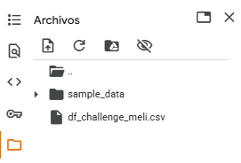

# Segmentación de Sellers

## Contexto

Este reto consiste en abordar un caso de negocio real, incorporando herramientas de Machine Learning e Inteligencia Artificial Generativa (GenAI). El objetivo principal es segmentar sellers para proponer estrategias comerciales personalizadas y escalar la solución con un módulo GenAI.

## Estructura del Repositorio

- `Challenge_Meli.ipynb`: Notebook completo con análisis explotarorio, modelo kmeans y extensión de Gen AI
- `prueba_meli.py`: Script Python
- `presentacion.pdf` (opcional): Slides para la sustentación.
- El archivo se sugiere subirlo manualmente a la terminal de Colab o de Jupyter como se ve en la imagen:
  
- 

## Instrucciones de Ejecución

1. **Descarga el CSV directamente de Drive** https://drive.google.com/drive/folders/1nGPM6Q3D7JGgnD3Q84520_HHms_NGkgR
2. **Abre el notebook** `Challenge_Meli.ipynb` en Google Colab, en caso de que la extensión no deje ver correctamente el código por los metadatos, este enlace lleva directamente al notebook en Google Colab:     
3. **Ejecuta cada celda en orden**. El notebook está organizado por secciones:
    - Carga del archivo, recordar montarlo manualmente a la terminal de Colab
    - Análisis exploratorio
    - Modelo de clustering
    - Extensión GenAI (clasificador)
4. **Reproducibilidad**
    - Semilla global: `np.random.seed(42)`
    - Semilla local en los modelos: `random_state = 42`

## Descripción de la Solución

- Se realiza un análisis exploratorio para entender los datos, los tipos de datos, distribución de variables numéricas, completitud de la información, etc.
- Se determina # óptimo de los clusters con el elbow method complementariamente con el Silhouette Score
- Se aplican técnicas de clusterización (K-means) para segmentar los sellers según las variables seleccionadas
- Perfilamiento de los clusters y recomendación de estrategias comerciales
- Se implementa un módulo GenAI:
    - **Opción A**: Clasificador semántico con embeddings generados por LLM, usando `SentenceTransformer` y `LogisticRegression`
- Librerías utilizadas: pandas, numpy, scikit-learn, matplotlib, seaborn, sentence-transformers

## Zoom a los clusters

| Cluster | Precio Promedio | Stock Promedio | Variedad de Categorías | Reputación | % Descuentos |
|---------|-----------------|----------------|-----------------------|------------|--------------|
| **0**   | Medio-bajo      | Bajo           | Baja                  | Media-alta | Muy bajo     |
| **1**   | Alto            | Muy bajo       | Baja                  | Baja       | Muy bajo     |
| **2**   | Medio-bajo      | Alto           | Media                 | Media      | Muy bajo     |
| **3**   | Bajo            | Medio          | Alta                  | Alta       | Alto         |

- El número de clusters fue seleccionado con base en el método del codo
- Se hicieron pruebas con más variables y no se veía una segmentación clara,se depuraron algunas para garantizar una segmentación relevante y accionable

## 👤 Autor
Santiago Dávila
